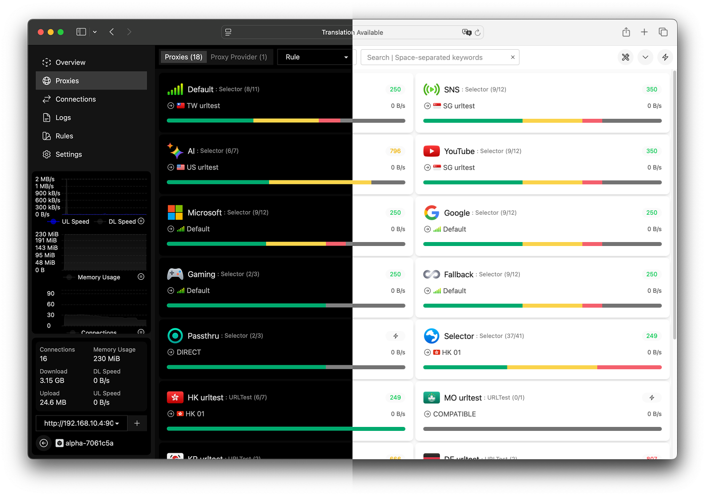

<h1 align="center">YAML.. lol</h1>

  <b><a href="https://wiki.metacubex.one/config/">Mihomo docs</a></b> | <b><a href="https://github.com/MetaCubeX/meta-rules-dat/tree/meta">MetaCubeX ruleset</a></b> | <b><a href="https://github.com/blackmatrix7/ios_rule_script/tree/master/rule/Clash">blackmatrix7 ruleset</a></b>
    
  
  
  

1.mihomo - `mihomo-router.yaml`

2.loon - `loon.conf`

### acknowledgements

- [Mihomo](https://github.com/MetaCubeX/mihomo/)
- [Sukkaw](https://github.com/SukkaW/Surge)
- [Kelee](https://t.me/iKeLee)
- [Zashboard](https://github.com/Zephyruso/zashboard)
- [Qure](https://github.com/Koolson/Qure)
- [七尺宇](https://youtu.be/watch?v=eUqf3lOhFSw)
